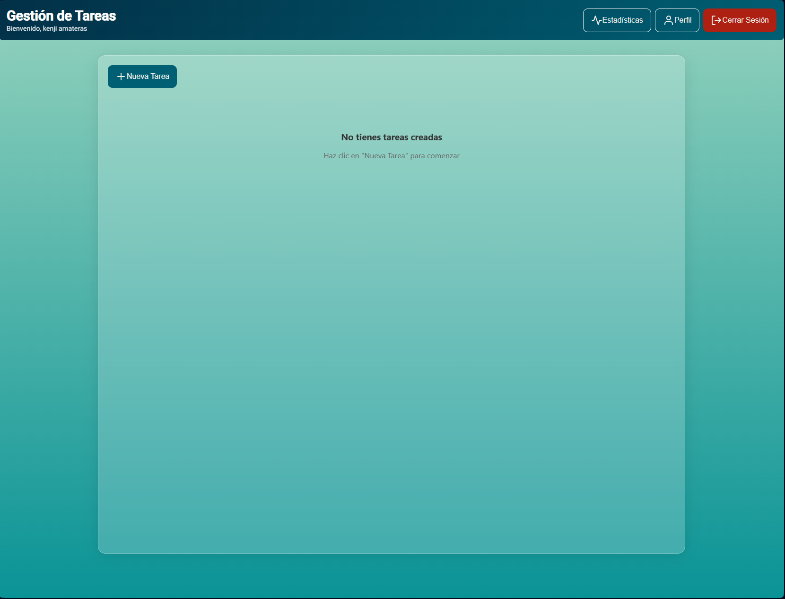

# Task Management App

Una aplicación completa de gestión de tareas construida con FastAPI, PostgreSQL y Angular.

🌐 **[Ver página del proyecto](https://andreskenji.github.io/task-management/)**

## 📋 Descripción

Task Management App es una aplicación web moderna que permite a los usuarios gestionar sus tareas de manera eficiente. La aplicación cuenta con un sistema de autenticación básica y proporciona una interfaz intuitiva para crear, editar, eliminar y visualizar tareas.

## 🏗️ Arquitectura

- **Backend**:  
- **Frontend**:  
- **Base de datos**: 
- **Containerización**: 
- **Autenticación**: 

## 🚀 Características

- ✅ Sistema de autenticación con JWT
- ✅ CRUD completo de tareas
- ✅ Interfaz de usuario moderna y responsiva
- ✅ Dashboard con estadísticas
- ✅ Dockerización completa
- ✅ Base de datos PostgreSQL

## 📋 Requisitos Previos

- Docker
- Docker Compose

## 🔧 Instalación y Ejecución

1. **Clona el repositorio**
   ```bash
   git clone https://github.com/AndresKenji/task-management.git
   cd task-management
   ```

2. **Ejecuta la aplicación con Docker Compose**
   ```bash
   docker compose up -d
   ```

3. **Accede a la aplicación**
   - Frontend: [http://localhost:4200](http://localhost:4200)
   - Backend API: [http://localhost:8000](http://localhost:8000)
   - Documentación API: [http://localhost:8000/docs](http://localhost:8000/docs)

## 🗂️ Estructura del Proyecto

```
📁task-management/
├── 📁 backend/
│   ├── 📁 app/
│   │   ├── 📁 auth/
│   │   ├── 📁 database/
│   │   ├── 📁 task/
│   │   └── 🐍 main.py
│   ├── 🐋 Dockerfile
│   └── 🗎 requirements.txt
├── 📁 frontend/
│   ├── 📁 taskManager/
│   │   ├── 📁 src/
│   │   ├── ⚙ angular.json
│   │   └── ⚙ package.json
│   ├── 🐋 Dockerfile
│   └── ⚙ nginx.conf
├── 📁 docs/
│   └── 📁 img/
├── 🐋 docker-compose.yml
└── 🗎 README.md
```

## 📱 Capturas de Pantalla

### Página de Login


La página de inicio de sesión proporciona un formulario seguro para que los usuarios accedan a la aplicación.

### Dashboard de Tareas


Vista principal donde los usuarios pueden visualizar todas sus tareas con opciones para editar, eliminar y marcar como completadas.

### Vista Sin Tareas


Interfaz limpia que se muestra cuando no hay tareas creadas, con un llamado a la acción para crear la primera tarea.

### Agregar Nueva Tarea


Modal intuitivo para crear nuevas tareas con campos para título, descripción y prioridad.

### Página de Estadísticas


Dashboard con métricas y estadísticas sobre el progreso y rendimiento de las tareas.

## 🛠️ Tecnologías Utilizadas

### Backend
- **FastAPI**: Framework web moderno y de alto rendimiento
- **PostgreSQL**: Base de datos relacional robusta
- **JWT**: Para autenticación segura
- **SQLAlchemy**: ORM para Python
- **Pydantic**: Validación de datos
- **Bcrypt**: Hash de contraseñas

### Frontend
- **Angular 15**: Framework de aplicaciones web
- **TypeScript**: Lenguaje de programación tipado
- **Angular Feather**: Iconos
- **RxJS**: Programación reactiva

### DevOps
- **Docker**: Containerización
- **Docker Compose**: Orquestación de contenedores
- **Nginx**: Servidor web para el frontend

## 🔒 Autenticación

La aplicación utiliza JWT (JSON Web Tokens) para la autenticación. Los usuarios deben registrarse e iniciar sesión para acceder a las funcionalidades de gestión de tareas.

## 🗄️ Base de Datos

La aplicación utiliza PostgreSQL como base de datos principal. La configuración se encuentra en el archivo `docker-compose.yml`:

- **Base de datos**: taskmanagement
- **Usuario**: postgres
- **Puerto**: 5432

## 📚 API Documentation

Una vez que la aplicación esté ejecutándose, puedes acceder a la documentación interactiva de la API en:
- Swagger UI: [http://localhost:8000/docs](http://localhost:8000/docs)
- ReDoc: [http://localhost:8000/redoc](http://localhost:8000/redoc)

## 🤝 Contribución

1. Fork el proyecto
2. Crea una rama para tu feature (`git checkout -b feature/AmazingFeature`)
3. Commit tus cambios (`git commit -m 'Add some AmazingFeature'`)
4. Push a la rama (`git push origin feature/AmazingFeature`)
5. Abre un Pull Request

## 📝 Licencia

Este proyecto está bajo la licencia MIT. Ver el archivo `LICENSE` para más detalles.

## 👨‍💻 Autor

**Andrés Kenji**
- GitHub: [@AndresKenji](https://github.com/AndresKenji)