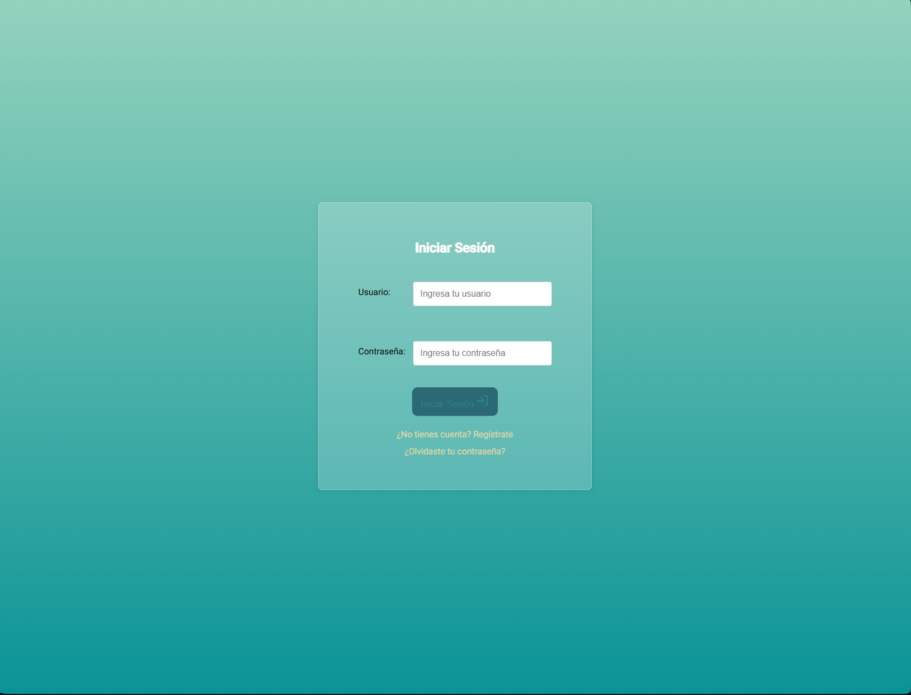
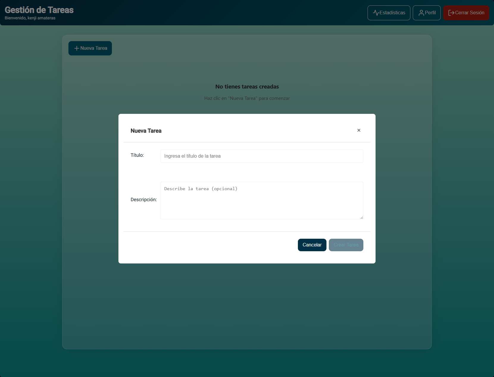

# Task Management App

Una aplicación completa de gestión de tareas construida con FastAPI, PostgreSQL y Angular.

🌐 **[Ver página del proyecto](https://andreskenji.github.io/task-management/)** | 📖 **[Documentación de la API](http://localhost:8000/docs)** | 🚀 **[Demo en vivo](https://andreskenji.github.io/task-management/)**

## 📋 Descripción

Task Management App es una aplicación web moderna que permite a los usuarios gestionar sus tareas de manera eficiente. La aplicación cuenta con un sistema de autenticación básica y proporciona una interfaz intuitiva para crear, editar, eliminar y visualizar tareas.

## 🏗️ Arquitectura

- **Backend**: FastAPI (Python)
- **Frontend**: Angular 15
- **Base de datos**: PostgreSQL 16
- **Containerización**: Docker & Docker Compose
- **Autenticación**: JWT Tokens

## 🚀 Características

- ✅ Sistema de autenticación con JWT
- ✅ CRUD completo de tareas
- ✅ Interfaz de usuario moderna y responsiva
- ✅ Dashboard con estadísticas
- ✅ Dockerización completa
- ✅ Base de datos PostgreSQL

## 📋 Requisitos Previos

- Docker
- Docker Compose

## 🔧 Instalación y Ejecución

1. **Clona el repositorio**
   ```bash
   git clone https://github.com/AndresKenji/task-management.git
   cd task-management
   ```

2. **Ejecuta la aplicación con Docker Compose**
   ```bash
   docker compose up -d
   ```

3. **Accede a la aplicación**
   - Frontend: [http://localhost:4200](http://localhost:4200)
   - Backend API: [http://localhost:8000](http://localhost:8000)
   - Documentación API: [http://localhost:8000/docs](http://localhost:8000/docs)

## 🗂️ Estructura del Proyecto

```
task-management/
├── backend/              # Backend FastAPI
│   ├── app/
│   │   ├── auth/        # Módulos de autenticación
│   │   ├── database/    # Configuración de base de datos
│   │   ├── task/        # Módulos de tareas
│   │   └── main.py      # Punto de entrada de la API
│   ├── Dockerfile
│   └── requirements.txt
├── frontend/            # Frontend Angular
│   ├── taskManager/
│   │   ├── src/
│   │   ├── angular.json
│   │   └── package.json
│   ├── Dockerfile
│   └── nginx.conf
├── docs/                # Documentación
│   └── img/            # Capturas de pantalla
├── docker-compose.yml
└── README.md
```

## 📱 Capturas de Pantalla

### Página de Login


La página de inicio de sesión proporciona un formulario seguro para que los usuarios accedan a la aplicación.

### Dashboard de Tareas


Vista principal donde los usuarios pueden visualizar todas sus tareas con opciones para editar, eliminar y marcar como completadas.

### Vista Sin Tareas


Interfaz limpia que se muestra cuando no hay tareas creadas, con un llamado a la acción para crear la primera tarea.

### Agregar Nueva Tarea


Modal intuitivo para crear nuevas tareas con campos para título, descripción y prioridad.

### Página de Estadísticas


Dashboard con métricas y estadísticas sobre el progreso y rendimiento de las tareas.

## 🛠️ Tecnologías Utilizadas

### Backend
- **FastAPI**: Framework web moderno y de alto rendimiento
- **PostgreSQL**: Base de datos relacional robusta
- **JWT**: Para autenticación segura
- **SQLAlchemy**: ORM para Python
- **Pydantic**: Validación de datos
- **Bcrypt**: Hash de contraseñas

### Frontend
- **Angular 15**: Framework de aplicaciones web
- **TypeScript**: Lenguaje de programación tipado
- **Angular Feather**: Iconos
- **RxJS**: Programación reactiva

### DevOps
- **Docker**: Containerización
- **Docker Compose**: Orquestación de contenedores
- **Nginx**: Servidor web para el frontend

## 🔒 Autenticación

La aplicación utiliza JWT (JSON Web Tokens) para la autenticación. Los usuarios deben registrarse e iniciar sesión para acceder a las funcionalidades de gestión de tareas.

## 🗄️ Base de Datos

La aplicación utiliza PostgreSQL como base de datos principal. La configuración se encuentra en el archivo `docker-compose.yml`:

- **Base de datos**: taskmanagement
- **Usuario**: postgres
- **Puerto**: 5432

## 📚 API Documentation

Una vez que la aplicación esté ejecutándose, puedes acceder a la documentación interactiva de la API en:
- Swagger UI: [http://localhost:8000/docs](http://localhost:8000/docs)
- ReDoc: [http://localhost:8000/redoc](http://localhost:8000/redoc)

## 🤝 Contribución

1. Fork el proyecto
2. Crea una rama para tu feature (`git checkout -b feature/AmazingFeature`)
3. Commit tus cambios (`git commit -m 'Add some AmazingFeature'`)
4. Push a la rama (`git push origin feature/AmazingFeature`)
5. Abre un Pull Request

## 📝 Licencia

Este proyecto está bajo la licencia MIT. Ver el archivo `LICENSE` para más detalles.

## 👨‍💻 Autor

**Andrés Kenji**
- GitHub: [@AndresKenji](https://github.com/AndresKenji)